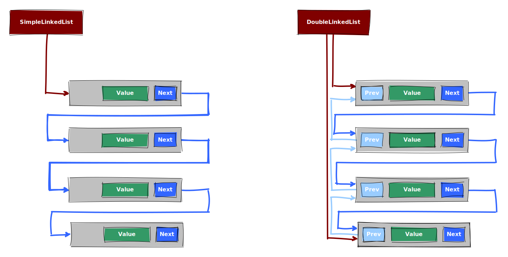

# FH Erfurt Java1 WS2021

Showcase for mechanisms of the programming language Java. It includes
 - Maven
 - Junit 5
 - AssertJ

for developing such a Java based project. It contains examples for
 - Simple linked list
 - Double linked list.

## Linked lists
The goal of the two implementations is to show how data structure like date can be realized with Java. The structure ins shown in

